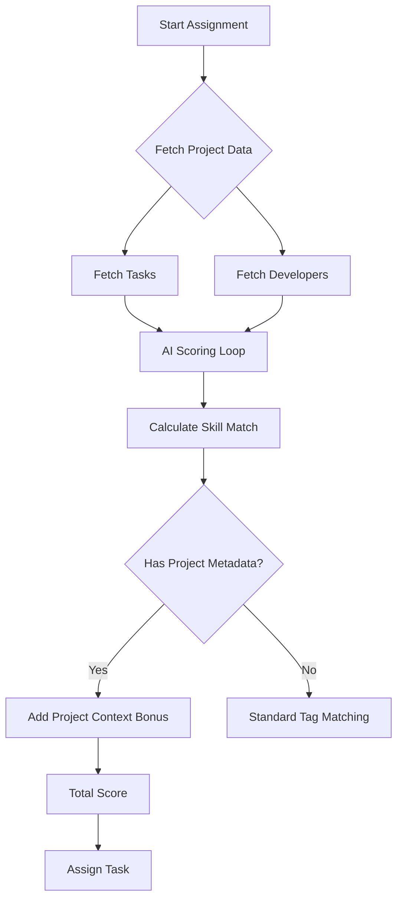

# Project Context Integration Update

## Overview
The AI Task Assigner now considers **Project-Level Metadata** when assigning tasks. This ensures developers are selected not just based on the task description, but also on their fit for the project's overall technology stack and architecture.

## What Changed?

### 1. New Data Source
The system now fetches project details directly from the database:
- `stack_type` (e.g., MERN)
- `backend_technologies` (e.g., Node, Express)
- `frontend_technologies` (e.g., React, Redux)
- `architecture_type` (e.g., Microservices)

### 2. New Scoring Component: "Project Alignment" (0-20 Points)
Added to the `calculate_skill_match_score` method.

| Condition | Points Awarded |
|-----------|----------------|
| **Tech Overlap** | **+2 points** per matching technology (up to 15 max) |
| **Architecture Fit** | **+5 points** if dev knows project architecture (e.g., knows 'Docker' for 'Microservices' project) |

### 3. Logic Flow


## Example Scenario

**Project**: "E-Commerce Platform"
- **Backend**: Node.js, MongolDB
- **Frontend**: React
- **Architecture**: Microservices

**Task**: "Fix login bug" (No tags)

**Developer A**: Knows PHP, MySQL
- Task Score: 0 (No tag match)
- Project Score: 0 (No stack match)
- **Total**: Low

**Developer B**: Knows React, Node, Docker
- Task Score: 0 (No tag match)
- Project Score: 
  - +2 (Node)
  - +2 (React)
  - +5 (Docker match for Microservices)
  - **= 9 Points Bonus**
- **Total**: **Higher (wins assignment)**

## Usage
The method `run_assignment` now accepts a `project_metadata` dictionary:

```python
project_data = {
    'backend_technologies': 'node, express',
    'frontend_technologies': 'react',
    'architecture_type': 'microservices'
}
assigner.run_assignment(project_id, project_metadata=project_data)
```

## Benefits
✅ **Better Fallback**: Works even when individual tasks have poor descriptions/tags.
✅ **Team Consistency**: Prioritizes developers who know the *whole* stack.
✅ **Architecture Awareness**: Smartly assigns complex architectural projects to devs with DevOps skills.
