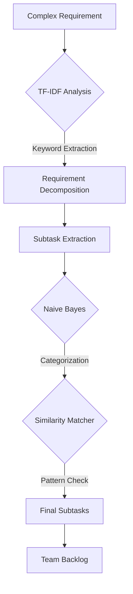

# 🛠️ Task Splitting Engine: Technical Architecture

This document provides a technical overview of the **AgileMindTools Task-Splitting Engine**, a machine learning-powered system designed to decompose complex project requirements into manageable, low-risk subtasks.

---

## 📖 1. Overview and Objectives
The primary goal of the Task-Splitting Engine is to **mitigate execution risks** associated with large project items. By automatically dividing complex requirements, the system ensures:
*   **Reduced Complexity**: Smaller items are easier to estimate and execute.
*   **Logical Decomposition**: Requirements are split based on functional boundaries.
*   **Structural Consistency**: New subtasks follow established team patterns.

---

## ⚙️ 2. Core Algorithms

The engine utilizes three primary algorithms to ensure accuracy and consistency:

### 🔍 A. Term Frequency-Inverse Document Frequency (TF-IDF)
*   **Role**: Technical Keyword Identification.
*   **Mechanism**: TF-IDF evaluates how important a word is to a specific task description relative to the entire project backlog. 
*   **Benefit**: This allows the system to ignore generic language and focus on critical technical terms (e.g., *"API"*, *"Authentication"*, *"Database Schema"*).

### 🏷️ B. Naive Bayes Classifier
*   **Role**: Logical Categorization & Priority Prediction.
*   **Mechanism**: A probabilistic classifier that predicts subtask categories (Tags) and priorities based on historical training data.
*   **Benefit**: It learns from thousands of past tasks to determine if a subtask belongs to "Frontend," "Backend," "DevOps," or "Database" automatically.

### 🧩 C. Semantic Similarity Matching (Cosine Similarity)
*   **Role**: Consistency & Pattern Recognition.
*   **Mechanism**: Uses vector comparison to ensure that the resulting subtasks are consistent with the past structural patterns of the team.
*   **Benefit**: It prevents the generation of "alien" structures that the team isn't used to, maintaining a familiar workflow.

---

## 🧠 3. Formal Process (Algorithm Style)

The following block represents the logical flow of the engine in a formal algorithmic format:

```text
___________________________________________________________________________________
Algorithm 1: Task-Splitting Engine Decomposition
___________________________________________________________________________________
Input:  Complex Project Requirement R
Output: Set of Optimized Subtasks S

   Initialisation:
1: Load TF-IDF Vectorizer and Naive Bayes Classifiers
2: Initialize Team History Patterns H and Similarity Threshold τ

   LOOP Process:
3: for each logical requirement unit u in R do
4:    Calculate Keyword Significance using TF-IDF
5:    Predict Category C and Priority P via Naive Bayes
6:    Calculate Semantic Similarity s = cos(vec(u), vec(H))
7:    if (s ≥ τ) then
8:       Generate Subtask s_new ← {description: u, category: C, priority: P}
9:       Append s_new to Result Set S
10:   end if
11: end for

12: return S
___________________________________________________________________________________

___________________________________________________________________________________
Algorithm 2: TF-IDF Weighting & Keyword Extraction
___________________________________________________________________________________
Input:  Term t, Document d, Corpus D
Output: Top-N Important Technical Keywords

   Weighting Process:
1: Calculate Term Frequency: TF(t, d) = (Count of t in d) / (Total terms in d)
2: Calculate Inverse Document Frequency: IDF(t, D) = log(N / (1 + nt))
3: Calculate Importance: Weight(t, d, D) = TF(t, d) × IDF(t, D)

   Extraction:
4: Sort all terms in document d by Weight in descending order
5: Select Top-N terms as "Technical Anchors"

6: return Top-N Keywords
___________________________________________________________________________________

___________________________________________________________________________________
Algorithm 3: Multi-Factor Assignee Scoring (AI-Enhanced)
___________________________________________________________________________________
Input:  Subtask s, Candidate Developer Set D
Output: Best Assignee a*, Confidence Score C

   Initialisation:
1: Define Score Weights: W_skill=70, W_history=60, W_workload=20, W_AI=40
2: Max_Score ← Σ(W_skill, W_history, W_workload, W_AI)

   SCORING Process:
3: for each Developer d in D do
4:    S_skill ← CalculateSkillOverlap(s.tags, d.tech_stack) + Experience_Bonus(d)
5:    S_history ← TrackRecord(d, s.type) + Completion_Efficiency(d)
6:    S_workload ← 20 × (1 - (d.current_load / Team_Max_Load))
7:    S_sim ← CosineSimilarity(vec(s), vec(d.profile)) × 20
8:    S_prob ← NaiveBayes_P(d | s.features) × 20
9:    Total_Score[d] ← S_skill + S_history + S_workload + S_sim + S_prob
10: end for

11: a* ← argmax(Total_Score[d])
12: return (a*, Confidence)
___________________________________________________________________________________
```

---

## 📊 4. The Splitting Pipeline



---

## 💻 5. Core Implementation (Source Code Perspective)

The following snippets illustrate how the abstract algorithms are implemented using **scikit-learn** and **Python**.

### 5.1 TF-IDF & Vectorization
The system uses the `TfidfVectorizer` to convert requirement text into numerical vectors, focusing on rare but significant terms.

```python
from sklearn.feature_extraction.text import TfidfVectorizer

# Initialize with n-grams to capture phrases like "database schema"
vectorizer = TfidfVectorizer(
    max_features=1000,
    stop_words='english',
    ngram_range=(1, 2)  # Captures both single words and pairs
)

# Transform text into numerical features
task_vectors = vectorizer.fit_transform(all_task_descriptions)
```

### 5.2 Naive Bayes Classification
Categorization is handled by the `MultinomialNB` model, which is ideal for discrete features like word counts.

```python
from sklearn.naive_bayes import MultinomialNB

# Training a tag classifier (e.g., 'API', 'UI', 'Bug')
tag_classifier = MultinomialNB(alpha=0.1)
tag_classifier.fit(task_vectors, historical_tags)

# Predicting tags for a new subtask
predicted_probs = tag_classifier.predict_proba(new_unit_vector)
```

### 5.3 Similarity Matching (Consistency)
To ensure the team's structural patterns are followed, **Cosine Similarity** measures the angle between the new subtask vector and historical vectors.

```python
from sklearn.metrics.pairwise import cosine_similarity

def check_consistency(new_vector, history_vectors):
    # Calculate similarity between new task and all past tasks
    similarities = cosine_similarity(new_vector, history_vectors)
    
    # Return the highest similarity score found
    return max(similarities[0])
```

## 🧪 6. Algorithm Logic Deep-Dive

### 6.1 TF-IDF: The "Technical Anchor" Logic
This algorithm allows the system to focus on what matters by balancing local frequency against global rarity:
*   **Term Frequency (TF)**: Measures how often a word appears in a specific task. High frequency suggests high relevance to that specific feature.
*   **Inverse Document Frequency (IDF)**: Measures how across the entire project backlog. Words that appear everywhere (like "the" or "update") are penalized, while rare technical terms (like "JWT" or "Redis") are boosted.
*   **The Result**: The system extracts the "Top-N" technical keywords to guide the splitting boundary and finding historical matches.

### 6.2 Multi-Factor Scoring: The "Hierarchy of Importance"
The assignment weights (**70-60-20-40**) are calibrated based on professional management priorities:
1.  **Skills (70 pts)**: The highest weight. A developer must have the technical ability (Common stack match) to execute the task.
2.  **History (60 pts)**: Reliability indicator. Proven track record in similar task types (e.g., Bug fixing vs Feature building).
3.  **AI Predictions (40 pts)**: Captures hidden patterns. Uses Cosine Similarity and Probabilistic modeling to find the best fit beyond simple rules.
4.  **Workload (20 pts)**: Prevents team burnout. A lower weight ensures accuracy is prioritized while still maintaining team balance.

---
*AgileMindTools: Bridging the gap between complex requirements and technical success.*
